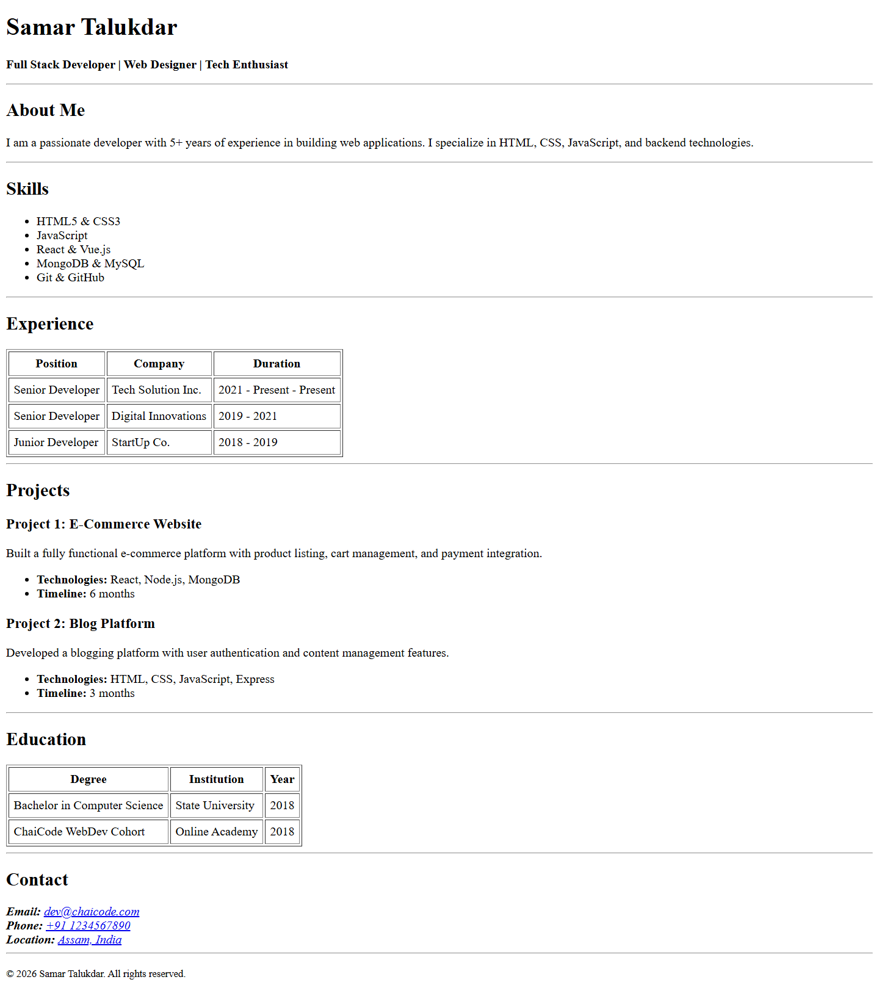

# 📄 Semantic HTML Resume

## 👋 About This Project
It is a personal Resume/CV website built entirely with **pure HTML**.

## 📸 Preview

 

The goal of this project was to learn the fundamentals of web structure before moving on to CSS or JavaScript. I focused heavily on **Semantic HTML** to ensure the code is meaningful, accessible, and structured correctly for search engines and screen readers.

## 🚀 How to View
Since this project uses only HTML, you don't need to install anything!
1. Download or clone this repository.
2. Locate the `index.html` file.
3. Double-click it to open it in your web browser (Chrome, Firefox, Safari, etc.).

---

## 📚 What I Learned: HTML Tag Breakdown

I learned that using the right tag is better than just using `
` for everything. Here are the specific tags I used and why:

### 🏗️ Structure & Layout
* **`<header>`**: Used to containerize the introductory content (my name and role).
* **`<main>`**: Wraps the primary content of the resume to help screen readers distinguish it from headers and footers.
* **`<section>`**: Used to group related content, such as "Experience," "Skills," and "Education."
* **`<article>`**: I used this for individual Projects. It signifies that each project entry is a self-contained piece of information.
* **`<footer>`**: Used for the copyright information at the bottom of the page.

### ♿ Accessibility & Data
* **`<table scope="col/row">`**: I learned that tables need structure! I added `scope="col"` to headers so screen readers know which header belongs to which data cell.
* **`<time>`**: Instead of writing dates as plain text, I used the `<time>` tag (e.g., `<time datetime="2026">2026</time>`) to make dates machine-readable.
* **`<address>`**: Used in the Contact section. This explicitly tells the browser that the contained information is contact details for the document owner.

### 📝 Text Formatting
* **`<h1>` - `<h3>`**: I established a proper heading hierarchy, using `<h1>` only once for the main title.
* **`<strong>`**: Used for bold text to indicate strong importance (semantic) rather than just visual styling (`<b>`).

---

## 🔮 Future Improvements
As I continue my coding journey, I plan to:
- [ ] Add a `style.css` file to style the layout and typography.
- [ ] Make the design responsive for mobile devices.
- [ ] Add a dark/light mode toggle using JavaScript.

---

*Thanks for checking out my learning journey!*
